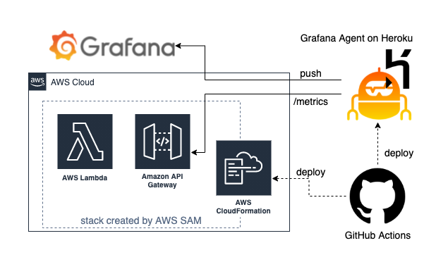

# toggl_exporter_serverless

This is the resource deploying [toggl_exporter](https://github.com/44smkn/toggl_exporter) to AWS Lambda using AWS SAM and GitHub Actions.

## Architecture

When the main branch is pushed, github actions workflow will be triggered and execute deployment of the cloudformation stack include a lambda function and a api gateway usinn AWS SAM.

